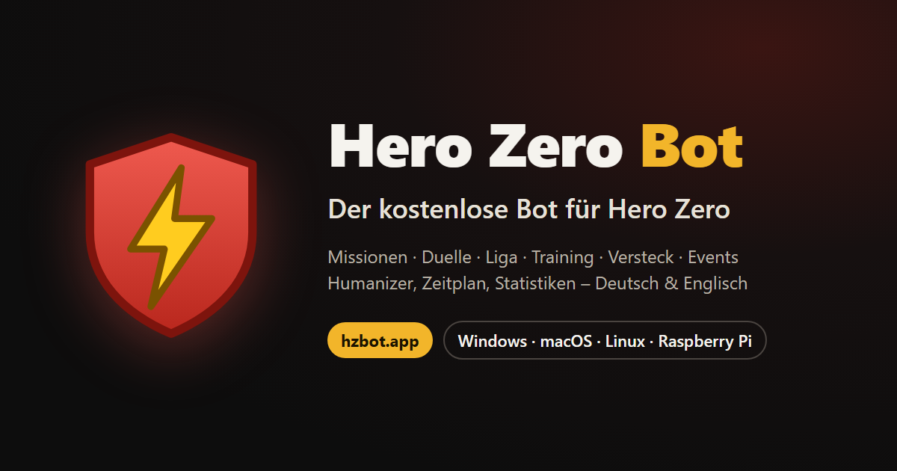
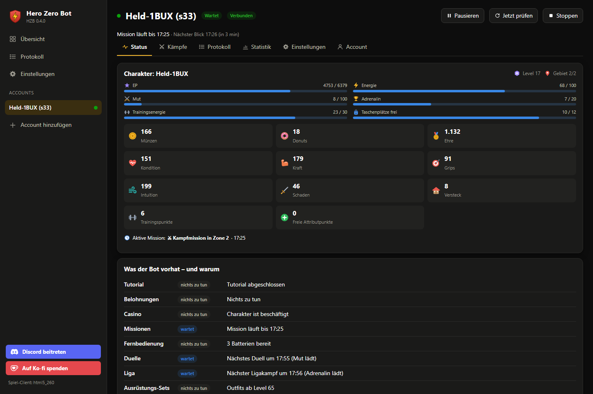
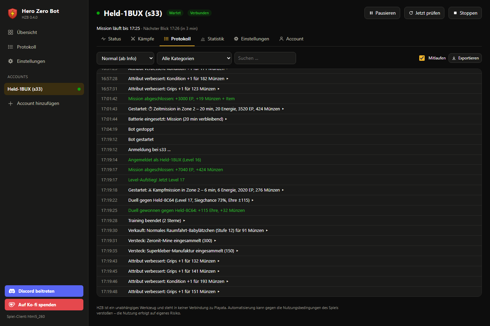
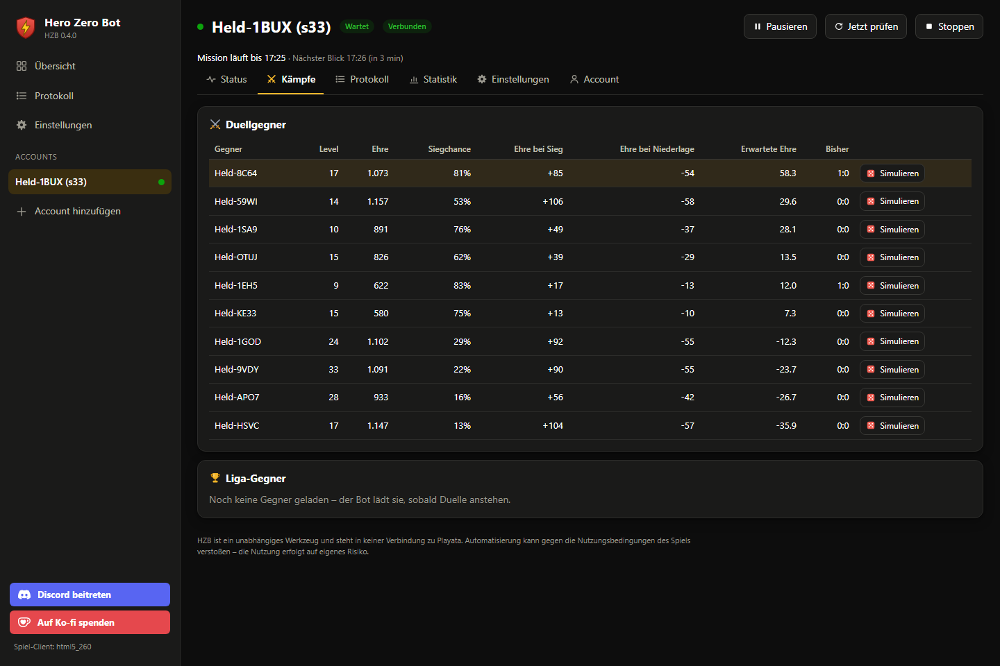

<div align="center">

<a href="https://hzbot.app"></a>

# Hero Zero Bot (HZB)

**Der kostenlose Bot für das Browserspiel *Hero Zero*.**
Missionen, Duelle, Liga, Training, Versteck, Events und Belohnungen – während du etwas anderes machst.

[](https://hzbot.app)
[](https://hzbot.app/downloads.html)
[](https://hzbot.app/downloads.html)
[](#ist-hzb-wirklich-kostenlos)
[](https://discord.gg/Wbgzrj3Gp)

**[🌐 hzbot.app](https://hzbot.app)** · **[⬇️ Download](https://hzbot.app/downloads.html)** · [Deutsch](#deutsch) · [English](#english)

</div>

---

## Deutsch

HZB spielt *Hero Zero* für dich – rund um die Uhr oder nach deinem Zeitplan. Er ist ein
eigenständiges Programm, kein Mod und keine Browser-Erweiterung: Er meldet sich wie der
offizielle HTML5-Client an und sendet dieselben Anfragen in derselben Reihenfolge. In das
Spiel wird nichts eingeschleust.

<p align="center"></p>

### Was HZB für dich erledigt

| | Bereich | Was passiert |
| --- | --- | --- |
| 🗺️ | **Missionen** | Bewertet jede angebotene Mission nach Ertrag pro Energie (oder Minute, Münzen, Gegenständen), wechselt das Gebiet, nutzt Energiespeicher und Batterien, spart vor Bonus-Tagen auf |
| ⚔️ | **Duelle & Liga** | Ein Kampfsimulator mit den Formeln des Spiels schätzt jede Siegchance und lernt aus jedem Kampf gegen denselben Gegner; Mut und Adrenalin werden voll genutzt |
| 🏋️ | **Training & Attribute** | Trainiert, sammelt Sterne und verteilt Kraft, Kondition, Grips und Intuition dorthin, wo die Siegchance gegen deine echten Gegner am stärksten steigt |
| 🎒 | **Gegenstände** | Beste Gesamtausrüstung samt Set-Boni und Wurfwaffe; verkauft Ramsch, bewahrt Epics und Sets im **Bankfach** auf und **macht für jede Belohnung Platz**, statt sie liegen zu lassen |
| 🏠 | **Versteck** | Sammelt Ressourcen, produziert Roboter, baut Räume in sinnvoller Reihenfolge aus, nutzt den Fitnessraum |
| 🛡️ | **Sondereinsätze** | Kämpft Sondereinsätze, Endlos- und Hardmode nur, wenn die Siegchance stimmt – während der passenden HeroCon jeden Endlos-Kampf |
| 🎁 | **Belohnungen** | Login- und Tagesbonus, Heldenbuch, Heldentaten, Saison, Sammlungen, Turniere, HeroCon, Geschenke |
| 🎉 | **Events** | Event-Ziele, Weltboss, Maulwurfjagd (mit Minesweeper-Löser), Ziehungs- und Suchbild-Events, Casino-Freispiele |
| 👥 | **Team & Begleiter** | Teamkämpfe, Team-Dungeons, Spenden auf Wunsch, Teamsuche; der stärkste Begleiter im Einsatz |

### Spielt wie ein Mensch

* **Denk- und Reaktionszeiten** statt Klick-Takt, gelegentliche Ablenkungen, manchmal die zweitbeste Wahl.
* **Sitzungen mit Pausen** – nach Zeitfenstern oder mit einem Tagesbudget, das jeden Tag andere Spielblöcke würfelt.
* **Macht Platz, wenn du selbst spielst:** Meldest du dich im Spiel an, pausiert HZB, statt dich hinauszuwerfen.
* **Tutorial-Schritte wie im Spiel:** Hinweise werden genau dann gesetzt, wann es der echte Client tut.

### Er sagt dir, was er tut – und warum

<p align="center"></p>

Für jedes Modul zeigt HZB den nächsten Schritt und den Grund – in den Worten des Spiels:

```text
Duelle        Nächstes Duell um 17:55 (Mut lädt)
HeroCon       HeroCon „Unermüdlich im Einsatz“ · zählt: Gewonnene Sondereinsätze · 2301 Punkte · endet Do 20:59
Gegenstände   Ins Bankfach gelegt: Satellitenhandy mit GPS und Flaschenöffner (episch, Stufe 37)
Belohnungen   Heldentat eingelöst: Geisterstunde! (1)
```

Das Protokoll lässt sich filtern und als Text oder JSON exportieren; auf Wunsch meldet HZB
Level-Aufstiege, Sperren oder Probleme per **Discord** oder **Telegram**. Der **Anonym-Modus**
ersetzt alle Namen, damit du Screenshots teilen kannst.

<p align="center"></p>

### Donuts sind echtes Geld – HZB gibt keine aus, solange du es nicht erlaubst

Jede Art von Donut-Ausgabe hat einen eigenen Schalter, alle sind aus. Dazu kommen ein
Hauptschalter, eine Mindestreserve und ein Wochenbudget.

### Läuft, wo du willst

| | |
| --- | --- |
| 🖥️ **Desktop-App** | Windows 10/11 (MSI), macOS 10.15+ (Intel, auf Apple Silicon über Rosetta 2), Linux (AppImage, .deb) – läuft beim Schließen im Infobereich weiter und aktualisiert sich selbst (signierte Updates) |
| 🍓 **Raspberry Pi & Server** | 64-Bit-.deb mit Systemdienst – rund um die Uhr ohne Bildschirm, bedient über die Weboberfläche, auch vom Handy |
| ⌨️ **Kommandozeile** | `hzb-cli` liefert JSON für Skripte: Status, Plan, Kampfsimulation, Statistik, Protokoll |

Beliebig viele Charaktere auf verschiedenen Welten laufen gleichzeitig, jeder mit eigenen
Einstellungen, Statistiken und Zeitplan. Einstellungen lassen sich als Vorlage teilen.

### Sicherheit und Datenschutz

* **Deine Daten bleiben bei dir.** HZB läuft auf deinem Gerät; Zugangsdaten gehen nur an die
  Hero-Zero-Server. Ein Konto bei uns brauchst du nicht.
* **Prüfbare Dateien.** Alle Installer werden automatisch gebaut; zu jeder Datei gibt es eine
  SHA-256-Prüfsumme auf der Download-Seite.
* **Ein Fehler stoppt nicht alles.** Lehnt das Spiel eine Aktion ab, wartet nur diese;
  Abstürze werden abgefangen, der Bot startet neu.

### FAQ

<details>
<summary><b>Ist HZB wirklich kostenlos?</b></summary>

Ja. Es gibt keine Bezahlversion und keine Funktionen hinter einer Bezahlschranke. Wer das
Projekt unterstützen möchte, kann das über [Ko-fi](https://ko-fi.com/ruffyg) tun.
</details>

<details>
<summary><b>Was brauche ich zum Anmelden?</b></summary>

Deine Welt (z. B. `s12`, steht in der Adresszeile des Spiels), deine E-Mail-Adresse und dein
Passwort. Das Passwort legst du im Spiel unter *Optionen* fest.
</details>

<details>
<summary><b>Kann ich nebenbei selbst spielen?</b></summary>

Ja. Meldest du dich im Spiel an, endet die Sitzung des Bots; HZB merkt das und macht eine
Pause, statt dich hinauszuwerfen.
</details>

<details>
<summary><b>Warum warnt Windows beim ersten Start?</b></summary>

Die Installer tragen keine kostenpflichtige Code-Signatur. Windows zeigt deshalb „Der Computer
wurde durch Windows geschützt“ (*Weitere Informationen → Trotzdem ausführen*), macOS fragt
beim ersten Start (*Rechtsklick → Öffnen*). Vergleiche im Zweifel die SHA-256-Prüfsumme mit
der auf der Download-Seite.
</details>

<details>
<summary><b>Wo ist der Quellcode?</b></summary>

Entwickelt wird in einem privaten Repository; dieses hier ist die öffentliche Anlaufstelle.
Die Installer entstehen dort automatisch per GitHub Actions und werden mit Prüfsummen auf
[hzbot.app](https://hzbot.app) veröffentlicht.
</details>

<details>
<summary><b>Ist die Nutzung erlaubt?</b></summary>

Automatisierung kann gegen die Nutzungsbedingungen von Hero Zero verstoßen. Mögliche Folgen
wie eine Verwarnung oder Sperre trägt allein der Nutzer. HZB spielt so menschlich wie
möglich, eine Garantie gibt es dafür nicht.
</details>

### Links

| | |
| --- | --- |
| 🌐 Website | https://hzbot.app |
| ⬇️ Download | https://hzbot.app/downloads.html |
| 💬 Discord (Fragen, Ideen, Neuigkeiten) | https://discord.gg/Wbgzrj3Gp |
| ☕ Unterstützen | https://ko-fi.com/ruffyg |

---

## English

HZB plays the browser game *Hero Zero* for you – around the clock or on your schedule. It is a
standalone program, not a mod or a browser extension: it signs in like the official HTML5
client and sends the same requests in the same order. Nothing is injected into the game.

**What it does:** quests (best reward per energy, zone changes, energy storage, batteries),
duels and league (a battle simulator with the game's formulas that learns from every fight),
training and attributes (where the win chance against your real opponents rises most),
items (best loadout with set bonuses and missiles; junk is sold, epics and sets are kept in
the bank, and room is made for every reward instead of leaving it behind), hideout, dungeons
(endless and hard mode only when the odds are good), rewards, events (world boss, mole hunt
with a minesweeper solver, draw and hidden object events, free casino spins), team and
sidekicks.

**Plays like a person:** thinking and reaction times, sessions with breaks (time windows or
a daily play budget), steps aside when you log in yourself, tutorial steps exactly like the
client.

**Explains itself:** for every module the next step and the reason, in the game's own words
(item, goal and HeroCon names come from the game's texts) – in German or English. Logs can
be filtered and exported, notifications go to Discord or Telegram, an anonymous mode hides
all names for screenshots.

**Donuts are real money:** every kind of spending has its own switch, all off, plus a master
switch, a reserve and a weekly budget.

**Runs where you want:** desktop app for Windows 10/11 (MSI), macOS 10.15+ (Intel; Apple
Silicon via Rosetta 2) and Linux (AppImage, .deb) with signed self-updates; a 64-bit .deb
with a system service for a Raspberry Pi or a server, controlled through the web interface;
`hzb-cli` for scripts. Any number of characters on different worlds at once.

**Free:** no paid tier, no locked features. Support it on [Ko-fi](https://ko-fi.com/ruffyg)
if you like.

**Download and details:** [hzbot.app](https://hzbot.app) ·
**Community:** [Discord](https://discord.gg/Wbgzrj3Gp)

---

<sub>Hero Zero Bot is an independent project and not affiliated with, endorsed by or connected
to Playata GmbH or Hero Zero. All trademarks belong to their owners. Automation may break the
game's terms of service; use at your own risk. · HZB ist ein unabhängiges Projekt und steht in
keiner Verbindung zu Playata GmbH oder Hero Zero. Nutzung auf eigenes Risiko.</sub>
